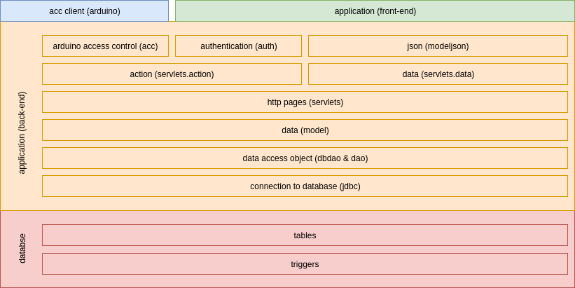

# Diario di lavoro

<table>
    <tr><td><b>Luogo:</b></td><td>Canobbio</td></tr>
    <tr><td><b>Data:</b></td><td>24.10.2019</td></tr>
</table>

    

        Lavori svolti
    

    

        Oggi mi sono preso tutte e 4 le ore per portarmi avanti con la documentazione, 
        siccome &egrave; diverso tempo che non lo faccio.  
        Ho ripreso anche i vecchi capitoli della documentazione e li ho approfonditi.
         
        Ho fatto 2 diagrammi, quello della struttura generale dell'applicativo, con i moduli principali ed anche quello con i sotto moduli. 
         
        Diagramma struttura generale 
         
         
        Diagramma struttura dettagliato 
    

    

        Problemi riscontrati e soluzioni adottate
    

    

        -
    

 

    

        Punto della situazione rispetto alla pianificazione
    

    

        Sono avanti con la pianificazione.
    

 

    

        Programma di massima per la prossima giornata di lavoro
    

    

        Andare avanti in parte con la documentazione ed iniziare a sviluppare il codice per la gestione dell'arduino.
    

