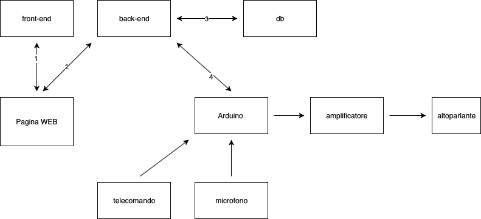

# Diario di lavoro

Lugano, 2019.09.03

## Lavori svolti

Oggi abbiamo letto tutti i QdC, per poi scegliere quello che sar&agrave; il nostro progetto per il
primo semestre.

Io ho scelto: _Generatore di frequenze con vari accessori gestito via web_.

Poi ho letto attentamento il QdC, scritto le domande, e le ho fatte al docente responsabile.

- vi &egrave; la possibilit&agrave; di utilizzare un server esterno? si
- come vengono generate le frequenze? da un arduino che controlla un amplificatore.
- attivazione vocale, bisogna riconoscere le voci? o si puo usare strumenti come alexa? No, basta un
microfono che attivi il circuito quando riceve un segnale al di sopra di un valore di riferimento.
- quante libert&agrave; ho per lo sviluppo dell'applicativo web? Sono autonomo nella scelta delle
tecnologie da utilizzare
        - containers?
        - linguaggio?
- che telecomando? Ancora da vedere

Dopo di che ho iniziato a pensare a come strutturare il progetto.

## Soluzioni adottate

## Punto della situazione rispetto alla pianificazione

## Programma di massima per la prossima giornata di lavoro
