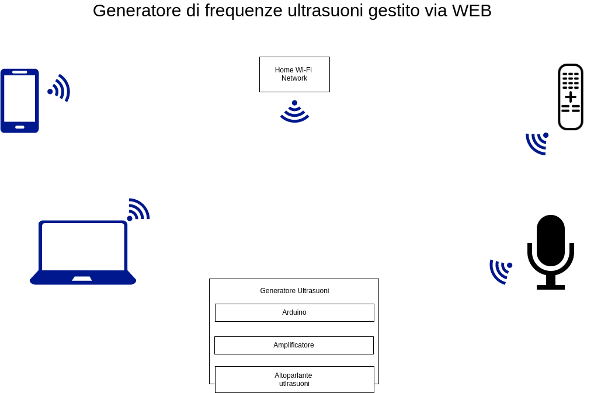

# Diario di lavoro

Lugano, 2019.09.03

## Lavori svolti

Avrei dovuto fare il diagramma di gantt, ma non avevo il software MS Project, quindi ho rimandato, e vado avanti con l'analisi del progetto.

Oggi ho scritto i requisiti del progetto ed ho iniziato a scrivere la documentazione, le informazioni sul progetto, lo scopo, l'analisi e la specifica dei requisiti e l'analisi dei mezzi.

Dopo di che ho creato il use case, con lo schema dei vari elementi che vi devono essere nel progetto.

Poi ho iniziato a pensare come strutturare il mio progetto in termini di tempo e come dividermi il tempo, quindi pensare alle attivit&agrave; da poi inserire nel diagramma di gantt. Prendendo appunti nel file [`analysis/gantt.md`](../analysis/gantt.md).

## Soluzioni adottate

Ho deciso di utilizzare [draw.io](https://draw.io) per sviluppare i diagrammi del progetto.

## Punto della situazione rispetto alla pianificazione

/

## Programma di massima per la prossima giornata di lavoro

Creare il diagramma di gantt per il progetto e iniziare a progettare il software.
