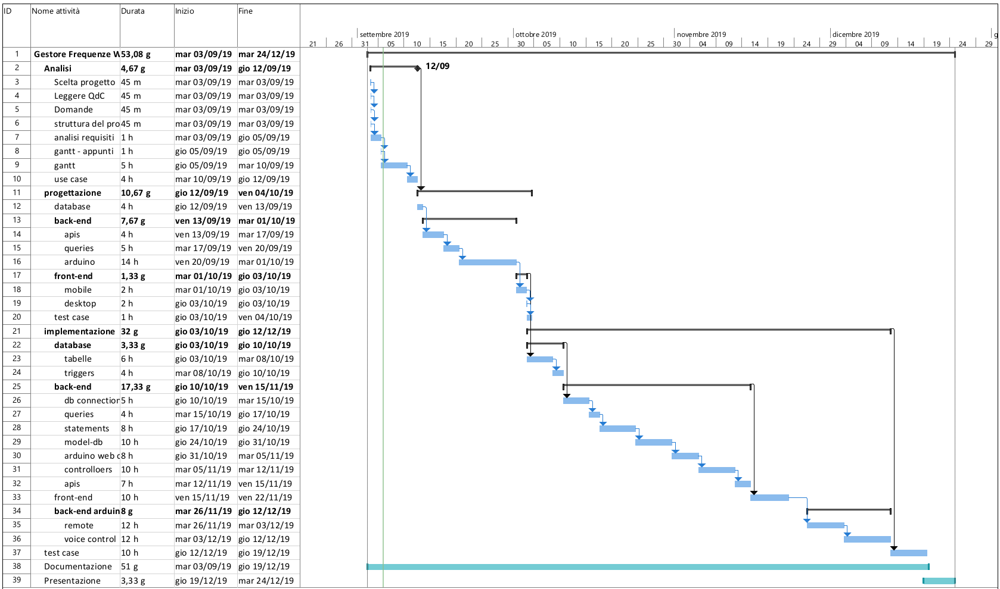

# Diario di lavoro

<table>
    <tr><td><b>Luogo:</b></td><td>Canobbio</td></tr>
    <tr><td><b>Data:</b></td><td>2019.09.06</td></tr>
</table>

    

        Lavori svolti
    

    

        Ho finito il gantt del progetto, con MS-Project. 
         
          
        Dopo di che mi sono informato meglio sugli _use case_, per  creare gli schemi. Con le documentazioni forniteci dai  docenti. Per poi rifare quello che stavo facendo la scorsa  lezione.  
        Per farlo ho deciso di utilizzare plantuml, che segue le    convenzioni UML, senza che io me ne debba preoccupare.
    

    

        Problemi riscontrati e soluzioni adottate
    

    

        Non riuscivo a settare i giorni festivi e gli orari di lavoro, su MS-Project, e 
        Paolo G&uuml;beli mi ha aiutato.
    

 

    

        Punto della situazione rispetto alla pianificazione
    

    

        Sono in linea con la pianificazione.
    

 

    

        Programma di massima per la prossima giornata di lavoro
    

    

        Finire di fare i test-case, seguendo tutte le convenzioni.
    

