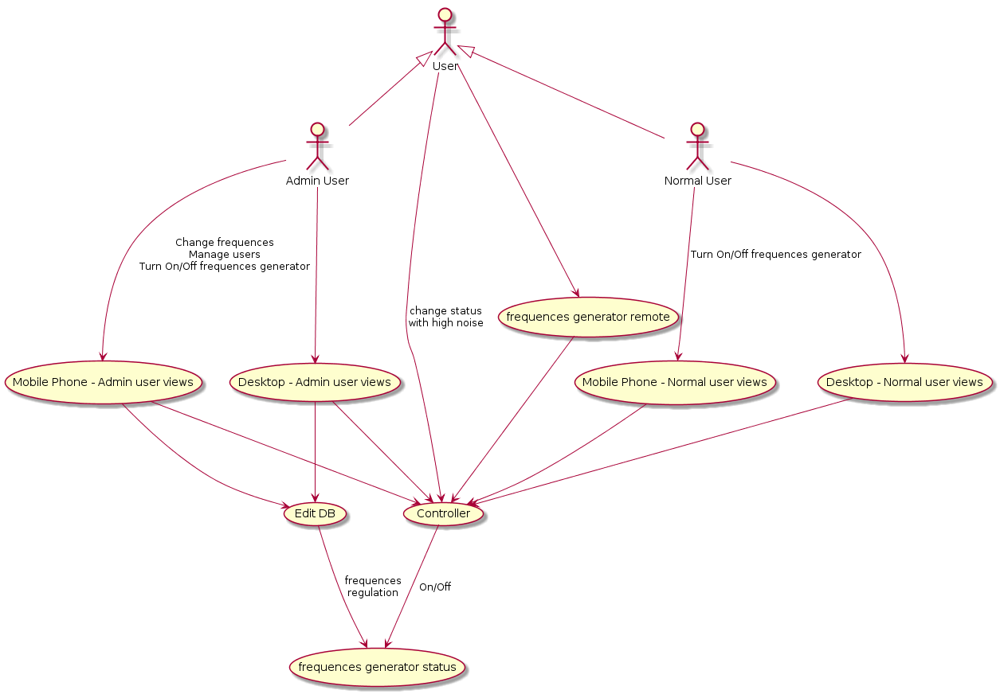

# Diario di lavoro

<table>
    <tr><td><b>Luogo:</b></td><td>Canobbio</td></tr>
    <tr><td><b>Data:</b></td><td>10.09.2019</td></tr>
</table>

    

        Lavori svolti
    

    

        Ho scritto fatto lo use case, nel quale si nota l'utente pu&ograve; modificare lo stato (On/Off) del generatore di frequenze tramite il telecomando, facendo un rumore forte, oppure tramite la pagina web, sia che esso sia un utente normale che esso sia un utente amministratore, in entrambi i casi pu&ograve; essere fatto sia via broswer desktop, che mobile. 
        L'utente amministratore potr&agrave; modificare la frequenza generata dal genratore in oltre potr&agrave; anche gestire gli altri utenti, crearne altri, modificare quelli esistenti ed eliminarli. 
         
         
         
        Dopo di che ho sistemato le date per i diari futuri, con il formato europeo. 
         
        Prima di passare alla progettazione, del database, voglio cercare di capire se vi &egrave; la possibilit&agrave; di avere un database sull'Arduino Y&Ugrave;N, che probabilmente sar&agrave; il microcontrollore usato nel progetto. 
        Facendo un po di ricerche su internet ho notato che moltissime persone hanno riscontrato problemi utilizzando MySQL sull'Arduino Y&Ugrave;N, quindi ho deciso di scartare per il momento l'idea dell'Arduino.  
        Prover&ograve; ad utilizzare un Raspberry PI 3 Model B. 
         
        Ho iniziato la progettazione del database, pensando a quali tabelle ci dovranno essere al suo interno per la gestione degli utenti.
    

 

    

        Problemi riscontrati e soluzioni adottate
    

    

        Ho riscontrato un problema nel DBMS da utilizzare sull'Arduino Y&Ugrave;N, siccome &egrave; un microcontrollore, con poca memoria e poco spazio disco. Quindi i software di cui si compone sulla piattaforma Linux OpenWRT (il suo sistema operativo), sono minimali. 
        Per il momento la soluzione &egrave; utilizzare Raspberry al posto di arduino.
    

 

    

        Punto della situazione rispetto alla pianificazione
    

    

        Sono avanti con la pianificazione, quindi ho gia iniziato a progettare la struttura del database. Anche se poi venerdi probabilmente riguarder&ograve; gli use case.
    

 

    

        Programma di massima per la prossima giornata di lavoro
    

    

        Per la prossima giornata di lavoro dovr&ograve; andare avanti con la progettazione del database.
    

