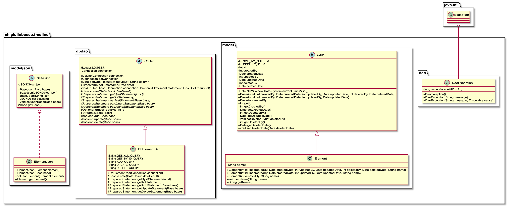

# Diario di lavoro

<table>
    <tr><td><b>Luogo:</b></td><td>Canobbio</td></tr>
    <tr><td><b>Data:</b></td><td>19.09.2019</td></tr>
</table>

    

        Lavori svolti
    

    

        Mi sono reso conto, che le queries che avrei dovuto progettare, le ho gi&agrave; progettate
        indirettamente quando progettavo il modello DAO, siccome &egrave; sono queries ricorsive.
         
         
        Quindi mi prendo del tempo per affinare la progettazione del modello DAO. 
         
         
         
        In questo diagramma si pu&ograve; notare, che molta logica &egrave; del modello dao,
        &egrave; stata spostata nelle classi superiori, che sono <code>abstract</code>. Questo permette di non
        dover scrivere pi&ugrave; volte il codice, generalizzando il codice.
        Per esempio nelle classi che estendono <code>DbDao</code>, bisogner&agrave; implementare solamente 6
        metodi, i quali servono per:
        <ul>
            <li><code>create</code>: in questo metodo, bisogna trasformare il result set passato come argomento in un oggetto, della classe modello (Che estende <code>Base</code>)</li>
            <li><code>getByIdStatement</code>: in questo metodo bisogna creare il <code>PreparedStatement</code> per esegiuire la query per selezionare un elemento, tramite l'id passato come argomento.</li>
            <li><code>getAllStatement</code>: in questo metodo bisogna creare il <code>PreparedStatement</code> per esegiuire la query per selezionare tutti gli elementi della tabella.</li>
            <li><code>getAddStatement</code>: in questo metodo bisogna creare il <code>PreparedStatement</code> per esegiuire la query per inserire un elemento nella tabella, tramite l'oggetto passato come argomento.</li>
            <li><code>getUpdateStatement</code>: in questo metodo bisogna creare il <code>PreparedStatement</code> per esegiuire la query per eseguire l'update di una riga, tramite l'oggetto passato come argomento.</li>
            <li><code>getDeleteStatement</code>: in questo metodo bisogna creare il <code>PreparedStatement</code> per esegiuire la query per eliminare una riga, tramite l'oggetto passato come argomento.</li>
        </ul>
         
        Poi ho iniziato la progettazione del controller. Capire se &egrave; meglio utilizzare
        l'arduino per controllare il generatore di onde ad ultrasuoni. Oppure direttamente il
        raspberry, che sar&agrave; anche il server, dove sar&agrave; istanziato il database e dove
        verr&agrave; eseguito l'applicativo web. 
         
        Cercando di capire come sviluppare il tutto, ho provato a cercare come comandare il circuito,
        che crea le onde, non sono riuscito a capire come controllarlo, quindi penso che la migliore
        delle ipotesi sia quella di riutilizzare la struttura che avevo utilizzato in un progetto
        dell'anno scorso: https://github.com/giuliobosco/domotics, quindi utilizzare un Arduino YUN,
        collegato via Ethernet o Wi-Fi al Raspberry (sul quale ci sar&agrave; il databse e la web
        app), e tramite i pin al generatore di frequenze.
    

 

    

        Problemi riscontrati e soluzioni adottate
    

    

        Non sapevo come gestiere il generatore di frequenze, inizialmente pensavo di utilizzare
        direttamente il raspberry, poi ho deciso di utilizzare il l'arduino YUN (Non &egrave; ancora
        una decisione definitiva).  
        Ho preso questa decisione siccome cercando in internet, ho riscontrato che molte persone
        hanno utilizzato l'arduino, siccome hanno avuto molti problemi con il raspberry.
    

 

    

        Punto della situazione rispetto alla pianificazione
    

    

        Ho finito quasi finito la progettazione, quindi sono in anticipo.
    

 

    

        Programma di massima per la prossima giornata di lavoro
    

    

        Fine della progettazione della parte arduino e del collegamento fra arduino ed il raspberry.
    

