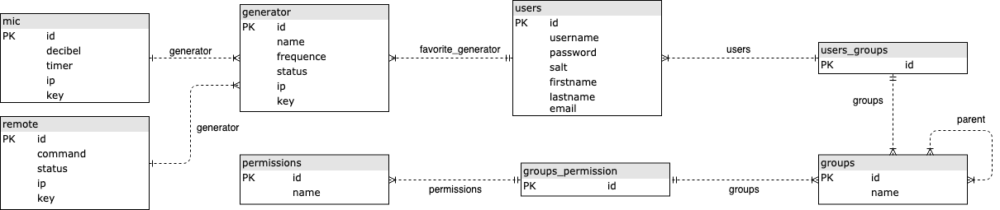

# Diario di lavoro

<table>
    <tr><td><b>Luogo:</b></td><td>Canobbio</td></tr>
    <tr><td><b>Data:</b></td><td>20.09.2019</td></tr>
</table>

    

        Lavori svolti
    

    

        Oggi ho ripreso lo schema del database, per progettare il funzionamento della comunicazione
        fra l'arduino ed il raspberry. E mi sono accorto che mi ero dimenticato una parte di
        database, la parte dove vengono salvati i dati relativi al microfono ed al telecomando
        per attivare e disattivare il generatore di frequenze. 
        Cos&igrave; ho ripreso il database e ho aggiunto le 2 tabelle mancanti (con relative tabelle
        di audit). Le tabelle sono <code>mic</code> (per il microfono) e <code>remote</code> per il
        telecomando. 
         
        Ho aggiornato sia il diagramma di base che quello avanzato. 
         
         
         
         
         
        La tabella del microfono contiene il livello di decibel che deve essere utilizzato come
        soglia, e gli elementi per l'identificazione del microfono. 
        Mentre per quanto riguarda il microfono viene memorizzato il comando che invia e i dati
        per l'identificazione del microfono. 
        Entrambe queste entit&agrave; dovranno passare tramite il controllo dell'arduino. 
         
        Come gi&agrave; scritto nel precedente diario, per la comunicazione fra Arduino e Raspberrry,
        utilizzer&ograve; il modello utilizzato nel progetto <code>domotics</code>
        (https://github.com/giuliobosco/domotics) che ho fatto l'anno scorso. 
        Quindi la progettazione &egrave; gi&agrave; stata fatta, quando riprender&ograve; in mano
        quella parte di progetto, probabilmente effettuer&ograve; qualche accorgimento nella
        struttura, solamente nel caso in cui ve ne sia necessit&agrave;. 
         
        Ho iniziato l'implementazione del progetto, quindi a creare il database. 
        Siccome alcune parti di questo database, sono gi&agrave; state fatte in un progetto:
        https://github.com/bomaidea/dbe, che sarebbe un esempio di database, per quanto riguarda
        l'utilizzo di audit, tabella per tabella. Al quale devo rimuovere la tabella
        <code>record</code> ed aggiungere le tabelle: 
        <ul>
            <li><code>generator</code></li>
            <li><code>mic</code></li>
            <li><code>remote</code></li>
        </ul>
        Ho creato il codice del database, al quale bisogna aggiungere i commenti ed i trigger, per
        gli audit delle tabelle. 
         
        Dopo di che sono andato avanti con la documentazione.
    

    

        Problemi riscontrati e soluzioni adottate
    

    

        Mancava una parte di database, per quanto riguarda la gestione del microfono e del
        telecomando, per risolvere il problema ho ripreso in mano la struttura del database e l'ho
        adattata alle mie esigenze.
    

 

    

        Punto della situazione rispetto alla pianificazione
    

    

        Sono avanti rispetto alla pianificazione, siccome ho gia iniziato a scrivere il codice del
        database.
    

 

    

        Programma di massima per la prossima giornata di lavoro
    

    

        Andare avanti con lo sviluppo del database.
    

