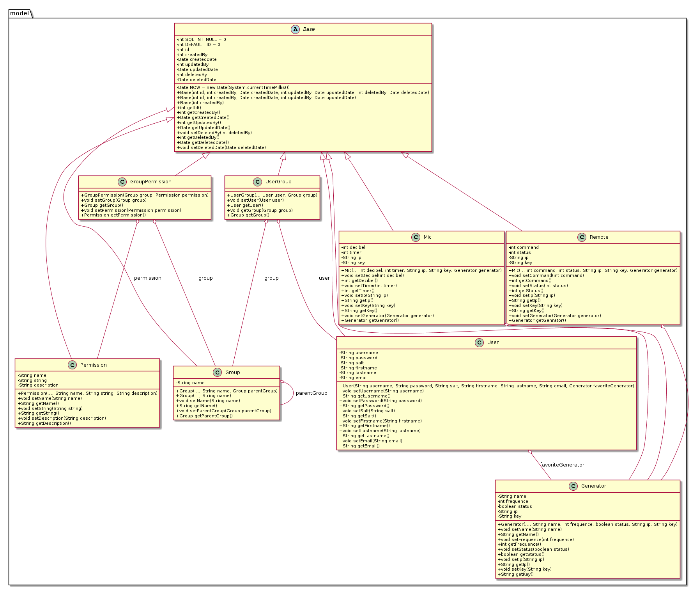

# Diario di lavoro

<table>
    <tr><td><b>Luogo:</b></td><td>Canobbio</td></tr>
    <tr><td><b>Data:</b></td><td>08.10.2019</td></tr>
</table>

    

        Lavori svolti
    

    

        Ho finito di implementare le classi dei modelli dei dati. Ed ho aggiornato il 
        diagramma delle classi:
         
         
        Dopo di che ho iniziato a sviluppare le classi di astrazione della connessione 
        database. 
        <h4>DaoException</h4>
        Ho implementato la classe <code>DaoException</code>, che estende semplicemente 
        la classe<code>Exception</code>, verr&agrave; utilizzata per le eccezioni 
        generali del modello dao. 
        <h4>DbDao</h4>
        Poi ho iniziato a scrivere la classe <code>DbDao</code> che sar&agrave; la 
        classe principale di comunicazione con il database. L'idea &egrave; che la maggior
        parte delle operazioni da eseguire per inserire, aggiornare e selezionare i dati
        nel database, vengano scritte in una sola classe, e non debbano venir riscritte
        per ogni classe. 
        Cosi facendo si scrive meno codice. Ma la classe di base &egrave; molto complicata.
         
         
        Per il momento ho creato la classe con alcuni metodi di aiuto che serviranno poi in
        futuro: 
        <pre><code>protected Date getDate(ResultSet resultSet, String column) throws SQLException {
    if (resultSet != null) {
        Timestamp timestamp = resultSet.getTimestamp(column);
        if (timestamp != null) {
        return new Date(resultSet.getTimestamp(column).getTime());
        } else {
            return null;
        }
    } else {
        throw new SQLException("Connection closed");
    }
}</code></pre> 
        Metodo che serve per richiedere una data da un a colonna di un sql result set. 
         
        <code><pre>protected Timestamp getTimestamp(Date date) {
    if (date != null) {
        return new Timestamp(date.getTime());
    } else {
        return null;
    }
}</pre></code> 
        Trasforma un oggetto data di java in oggetto Timestamp di SQL. 
    

 

    

        Problemi riscontrati e soluzioni adottate
    

    

        -
    

 

    

        Punto della situazione rispetto alla pianificazione
    

    

        Sono ancora avanti rispetto alla pianificazione.
    

 

    

        Programma di massima per la prossima giornata di lavoro
    

    

        Finire di scrivere la classe di <code>DbDao</code>
    

