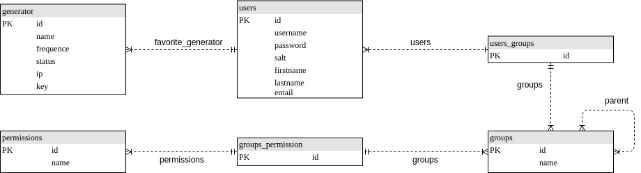
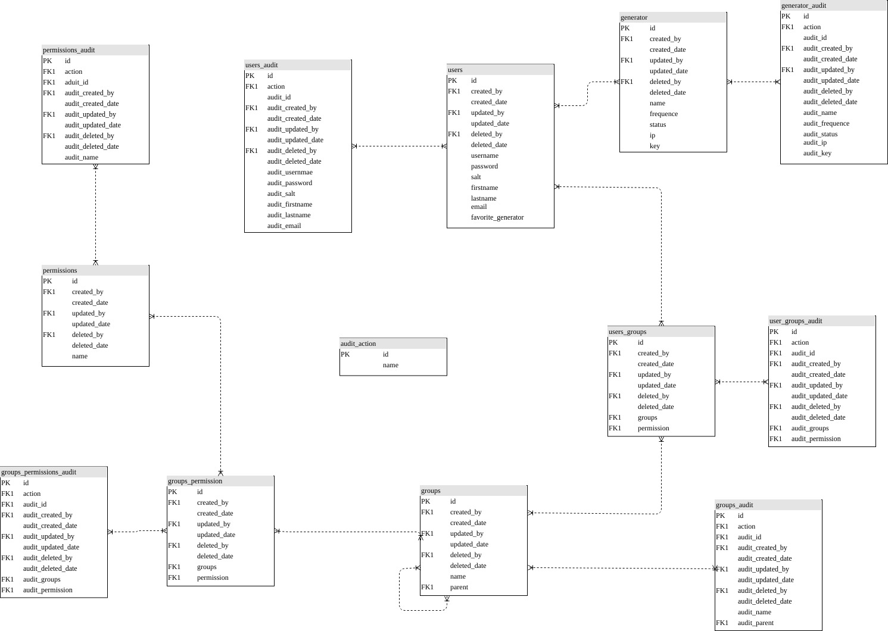

# Gestione di generatore frequenze tramite pagina web

- [1 Introduzione](#1 Introduzione)
	- [1.1 Informazioni sul progetto](# 1.1 Infomrmazioni sul progetto)
	- [1.2 Abstract](#1.2 Abstract)
	- [1.3 Scopo](#1.3 Abstract)
	- [1.4 Analisi del dominio](#1.4 Analisi del dominio)
	- [1.5 Analisi e speficifa dei requisiti](# 1.5 Analisi e speficifa dei requisiti)

# 1 Introduzione

## 1.1 Infomrmazioni sul progetto

Docente Responsabile: Fabrizio Valsangiacomo  
Apprendista: Giulio Bosco  
Data inizio progetto: 05.09.2019  
Data consegna progetto: 20.12.2019

## 1.2 Abstract

## 1.3 Scopo

Creare un interfaccia di gestione per un generatore di frequenze ultrasoniche, con la possibilit&agrave; di essere gestito da pi&ugrave; utenti, quindi si necessita anche una piattaforma per gestire gli utenti.  
Il generatore deve poter essere acceso e spento tramite un telecomando, tramite un suono (un suono qualunque pi&ugrave; alto di una determinata soglia, in decibel), tramite interfaccia WEB.

## 1.4 Analisi del dominio

## 1.5 Analisi e speficifa dei requisiti

<table style="witdh:100%;">
	<tr><th style="width:100px"></th><th>ID :REQ-01</th></tr>
	<tr><td>Nome:</td><td>Gestione generatore tramite WEB</td></tr>
	<tr><td>Prorit&agrave;:</td><td>1</td></tr>
	<tr><td>Versione:</td><td>1.0</td></tr>
	<tr><td>Note:</td><td>-</td></tr>
</table>

<table style="witdh:100%;">
	<tr><th style="width:100px"></th><th>ID :REQ-02</th></tr>
	<tr><td>Nome:</td><td>Gestione generatore tramite Telecomando</td></tr>
	<tr><td>Prorit&agrave;:</td><td>1</td></tr>
	<tr><td>Versione:</td><td>1.0</td></tr>
	<tr><td>Note:</td><td>-</td></tr>
</table>

<table style="witdh:100%;">
	<tr><th style="width:100px"></th><th>ID :REQ-03</th></tr>
	<tr><td>Nome:</td><td>Gestione generatore tramite Rumore</td></tr>
	<tr><td>Prorit&agrave;:</td><td>1</td></tr>
	<tr><td>Versione:</td><td>1.0</td></tr>
	<tr><td>Note:</td><td>-</td></tr>
</table>

<table style="witdh:100%;">
	<tr><th style="width:100px"></th><th>ID :REQ-04</th></tr>
	<tr><td>Nome:</td><td>Pagina WEB - Amministrazione utenti</td></tr>
	<tr><td>Prorit&agrave;:</td><td>1</td></tr>
	<tr><td>Versione:</td><td>1.0</td></tr>
	<tr><td>Note:</td><td>-</td></tr>
	<tr><td></td><td>Sotto requisiti:</td></tr>
	<tr><td>001</td><td>Gestione utenti</td></tr>
	<tr><td>002</td><td>Gestione permessi utenti</td></tr>
</table>

## 1.6 Pianificazione 

## 1.7 Analisi dei mezzi

### 1.7.1 Software

- Arduino IDE (v1.8.9)
- Atom IDE (v1.38.2)
- plantuml (Version 1.2019.9)

### 1.7.2 Hardware

- Mac Book Pro 2018 Intel&reg; Core&trade; i7 CPU 3.1GHz RAM 16GBo- Arduino UNO (Rev 3)
- Circuito amplificatore

## 2 Progettazione

### 2.1 Architettura del progetto

### 2.2 Design delle interfacce

### 2.3 Architettura del Database

Per lo sviluppo del database, ho prima di tutto creato il minimo indispensabile per il progetto, quindi tutte le tabelle di cui necessito, tutti gli attributi, senza il quale il progetto non funziona.  

Lista delle tabelle:

- generators
- users
- groups
- permissions

Dopo di che ho pensato potesse essere una buona idea tenere traccia delle operazioni eseguite sul database. Questo perch&eacute; &egrave; dal lato della piattaforma WEB, il progetto &egrave; piccolo. Quindi potrei investire del tempo nello sviluppare questa parte del progetto, che potrebbe comunque essere riutilizzata in qualunque progetto. 

Per eseguire i log delle azioni effettuate sulle banche dati, vi sono diversi modi:

1. Eseguire il log delle azioni di tutte le tabelle in una tabella di log, nella quale si inserisce la query eseguita, l'autore, la data e l'ora.
2. Eseguire il log in una tabella dedicata per ogni tabella, nella quale si inseriscono tutte le azioni che vengono eseguite sulle tabelle.
3. Eseguire il log nell'applicativo, quindi inserire una parte del software che esegua il log del database.
4. Si potrebbe utilizzare un software di monitoraggio della bancadati.

Analizzando queste opsioni ho trovato questi pro e questi contro, di ogni metodologia.

|Metodo|Punti a favore|Punti contro|
|------|--------------|------------|
|1|<ul><li>Semplice implementazione e integrazione con la bancadati</li><li>Facile ricostruzione del DB</li></li></ul>|<ul><li>Difficile creare dei report sui log</li></ul>|
|2|<ul><li>Facilizza generazione di report delle azioni sul DB</li><li>mantiene separati i dati</li></ul>|<ul><li>Implementazione del database pi&ugrave; complessa</li></ul>|
|3|<ul><li>Facile implementazione del database</li></ul>|<ul><li>Complica struttura del software</li><li>Nel caso in cui vi fossero in futuro pi&ugrave; elementi che aggiscono sullo stesso database, i log non sarebbero autentici</li></ul>|
|4|<ul><li>Semplifficherebbe il codice</li><li>Semplificherebbe il codice</li></ul>|<ul><li>Dovrei prendere del tempo per imparare ad utilizzare un altro software</li><li>Richiederebbe pi&ugrave; risorse</li></ul>|

Analizzando questi punti, ho deciso di utlizzare il secondo metodo.

Del database, vi sono 2 schemi. Uno che contiene lo schema di base, quindi solamente le informazioni rilevanti per il progetto. Ed uno completo che comprender&agrave; anche gli attributi e le tabelle legati al log.

In questo schema vi sono le tabelle con gli attributi minimi, per far funzionare l'applicativo. Vi &egrave; una tabella `generator` che d&agrave; la possibilit&agrave; di inserire diversi generatori, i quali hanno un nome, una frequenza alla quale devono lavorare, uno stato, un IP ed una key (pensata per creare una comunicazione sicura fra il server ed i controller degli altoparlanti). Questo per permette al progetto di essere espandibile.  
Dopo di che vi sono le tabelle users, groups, e permissions, che servono per gestire i permessi. fra le varie tabelle vi sono anche le tabelle ponte, per permettere le relazioni molti a molti.

In questo schema si possono notare molte pi&ugrave; tabelle e pi&ugrave; attributi, per ogni tabella che vi era nello schema antecedente, 6 attributi, che servono per salvare la data e l'autore delle azioni principali che si possono fare sul database (create, update, delete). In oltre vi &egrave; un altra tabella, nella quale si inseriscono gli audit, cio&eacute; gli stessi parametri, con in pi&ugrave; l'azione eseguita ed un id per ogni audit. Le relazioni fra le tabelle di audit e la tabella `audit_aciton` non sono rappresentate, come le relazioni fra tutti i campi discussi prima e la tabella `users`, questo per permettere una miglior leggibilit&agrave; dello schema.

